<div align="center">

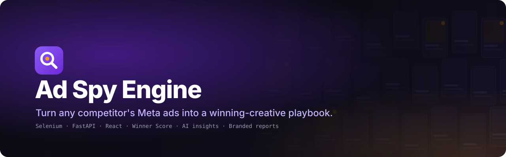

<p>
  
  
  
  
  
  
  
  
  
</p>

</div>

**Ad Spy Engine** is a local-first app for marketers and agencies. Type a competitor's name and it
scans the public Meta Ad Library with Selenium, collects every active ad with its copy, dates,
placements and creatives, scores which ads are probably **winners**, and shows everything in a
live dashboard. Track competitors on a schedule, get alerted when they launch or kill ads, build
swipe files, and export branded PDF reports for clients. It runs on your machine with no
subscription and no login to Facebook.

<div align="center">
  <!--
    Demo GIF: record ~20 seconds at 1440×900 of
    New Scan ("Gymshark", exact page) → Live Scan filling up → Results Gallery → open an ad →
    Reports → Generate → PDF preview. Save as docs/assets/demo.gif (≤ 10 MB) and uncomment the
    line below. Tools: ScreenToGif (Windows), Kap or Gifski (macOS).
  -->
  <!-- 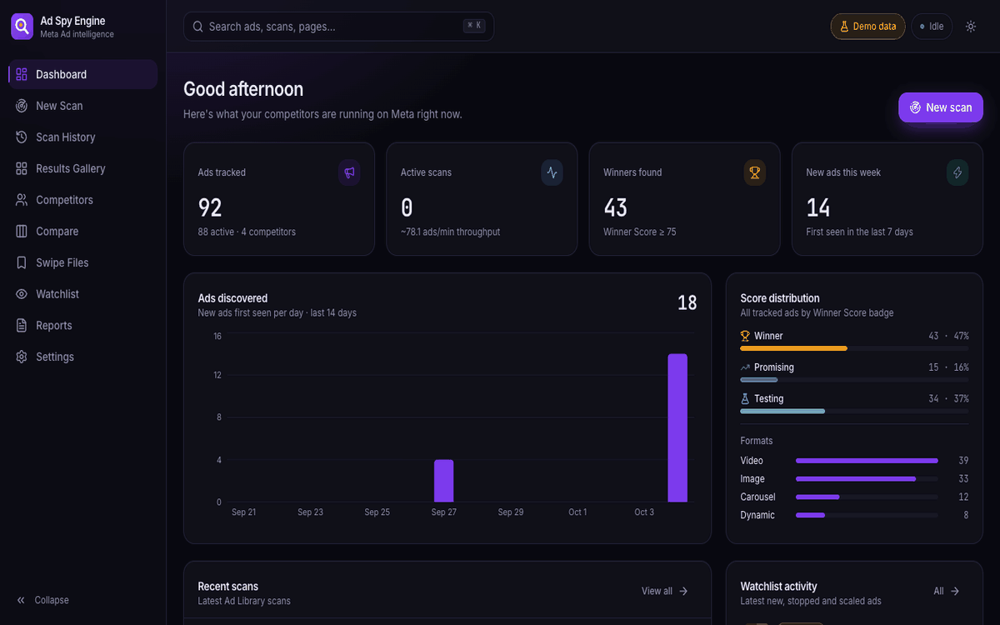 -->
  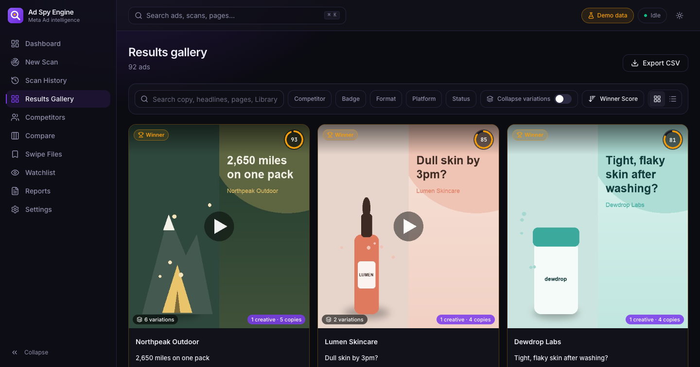
</div>

## 💡 Why Ad Spy Engine?

<table>
  <tr>
    <td width="33%" valign="top">
      <h3>🏆 Find winners</h3>
      Every ad gets a <b>Winner Score</b> from how long it has run, how many variations it has,
      where it's placed and whether it's still live. Click any score to see the exact maths.
    </td>
    <td width="33%" valign="top">
      <h3>👀 Track competitors</h3>
      Daily or weekly re-scans detect <b>new</b>, <b>stopped</b> and <b>scaled</b> ads, then
      alert you on Telegram or email. Compare 2–3 brands side by side.
    </td>
    <td width="33%" valign="top">
      <h3>📄 Client-ready reports</h3>
      Branded A4 PDFs with your logo: executive summary, top winners, creative-mix charts,
      change log and "Opportunities for you", written by AI or derived from the data.
    </td>
  </tr>
</table>

## ✨ Features

<details open>
<summary><b>Core engine</b></summary>

- ✅ Keyword or exact Page ID search with country, media type, placement and status filters
- ✅ Hybrid extraction: the structured JSON the page already loads (including `/api/graphql/`
  pagination), with a text-anchored DOM parser as fallback
- ✅ Per-ad card screenshots and creative downloads (size-limited, threaded)
- ✅ Humanized scrolling, retries with backoff, blocking detection (login wall, checkpoint, captcha)
- ✅ CLI: `python cli.py scan "Nike" --country US`
</details>

<details open>
<summary><b>Dashboard</b></summary>

- ✅ Live scan view over Server-Sent Events: progress ring, counters, streaming thumbnails, log console
- ✅ Results Gallery: masonry/list, filters, search, sort, bulk export and bulk "Save to board"
- ✅ Ad Detail panel: creative, full copy, "Why this score", variation group, landing page, AI notes
- ✅ ⌘/Ctrl+K command palette, dark and light themes, responsive down to phones
</details>

<details open>
<summary><b>Intelligence</b></summary>

- ✅ Variation grouping with perceptual hashing (pHash + LSH) and near-duplicate copy matching
- ✅ Landing page screenshots for each distinct destination (tracking parameters stripped)
- ✅ Optional AI copy analysis with Claude: hook type, angle, emotion, offer, audience, "what to steal"
  (structured JSON, cached per ad, cost shown before every run)
- ✅ Competitor profiles: launch timeline, format/placement/CTA mix, top hooks and angles
</details>

<details open>
<summary><b>Monitoring</b></summary>

- ✅ Watchlist with daily/weekly schedules (APScheduler); missed runs catch up on start
- ✅ Change detection between scans: new, stopped, scaled; safeguards against false "stopped"
- ✅ Telegram and SMTP email alerts with a "Send test" button
</details>

<details open>
<summary><b>Agency mode</b></summary>

- ✅ Client folders that group competitors
- ✅ Compare screen for 2–3 brands with measured highlights and opportunities
- ✅ Swipe files: boards with notes and tags
- ✅ Branded PDF reports: client, comparison, competitor or single-scan scope
- ✅ "Brand's own ads only" filter (keyword searches also return other advertisers)
</details>

## 📸 Screenshots

> Screens show the built-in **demo dataset**: fictional brands with generated creatives
> (`scripts/seed_demo.py`). No real company's ads appear here.

<table>
  <tr>
    <td width="50%">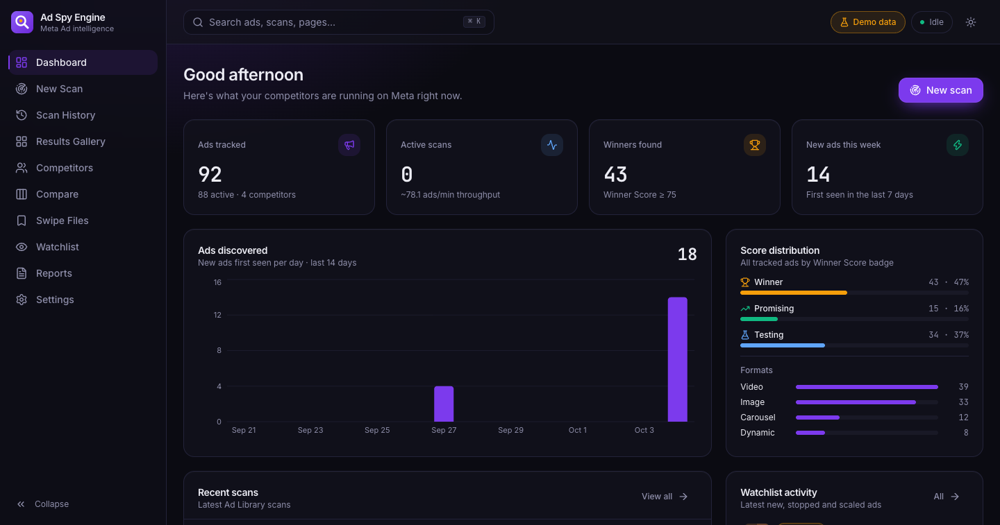<br><sub><b>Dashboard:</b> KPIs, discoveries, score distribution, recent scans</sub></td>
    <td width="50%">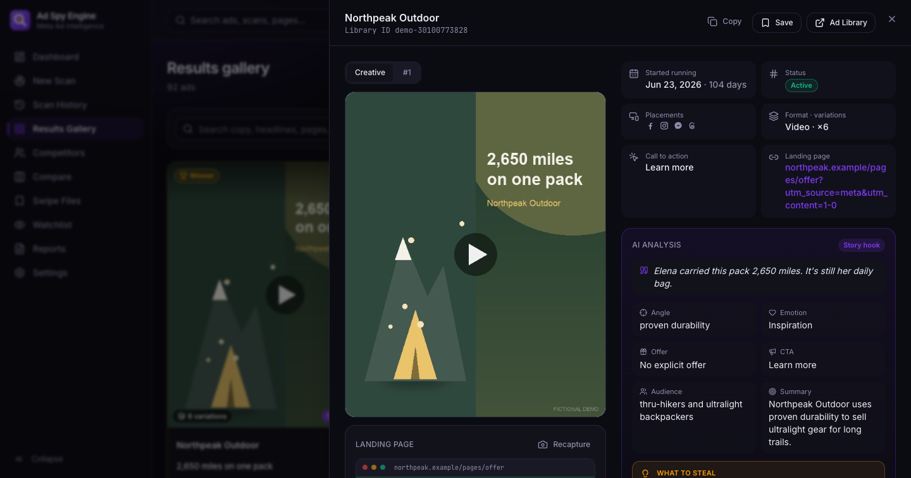<br><sub><b>Ad Detail:</b> creative, AI analysis and landing page</sub></td>
  </tr>
  <tr>
    <td>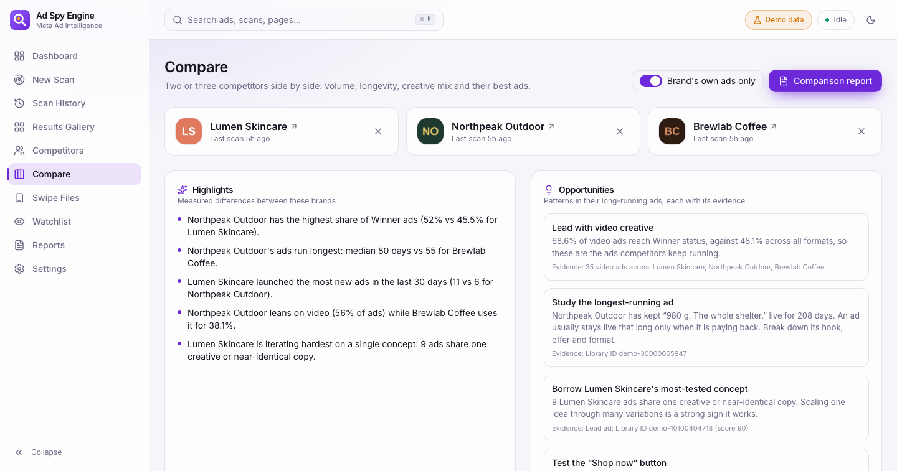<br><sub><b>Compare:</b> highlights, opportunities and a scoreboard for 2–3 brands</sub></td>
    <td>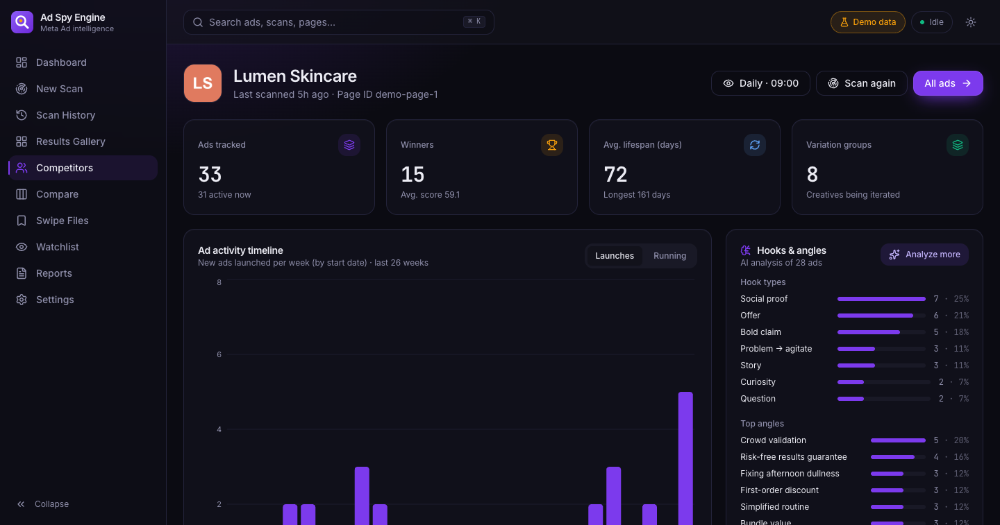<br><sub><b>Competitor profile:</b> launch timeline, hooks and angles</sub></td>
  </tr>
  <tr>
    <td>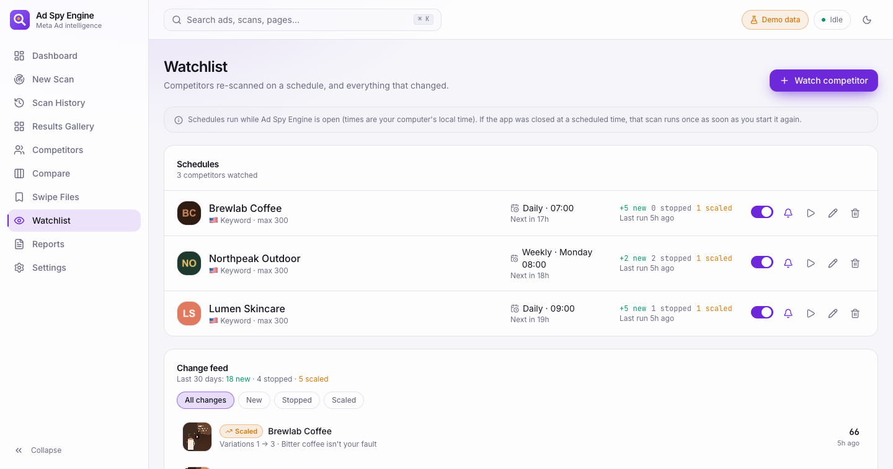<br><sub><b>Watchlist:</b> schedules and the change feed</sub></td>
    <td>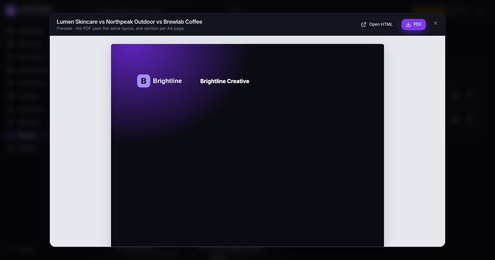<br><sub><b>Reports:</b> branded PDF with in-app preview</sub></td>
  </tr>
</table>

<details>
<summary>More screens (light and dark)</summary>

| | |
|---|---|
| 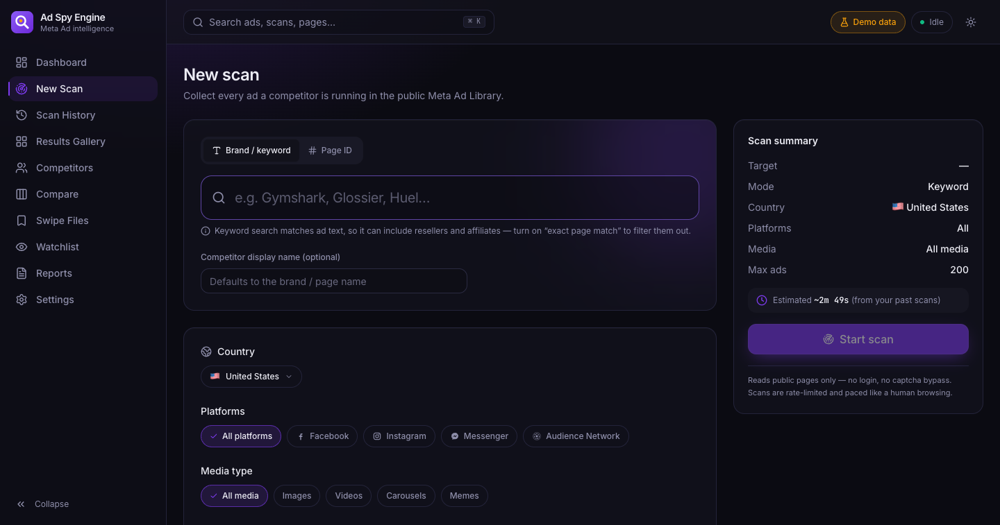 | 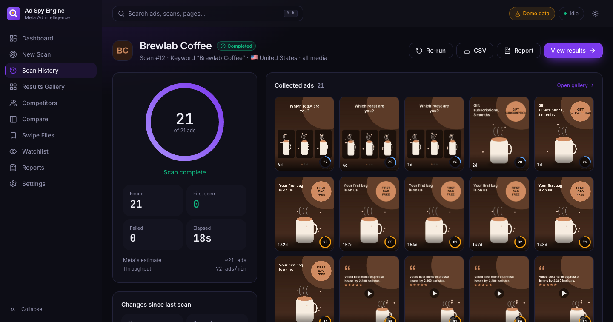 |
| 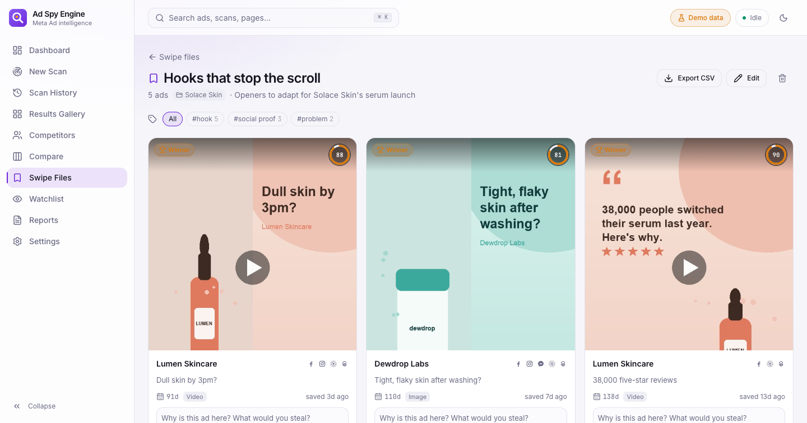 | 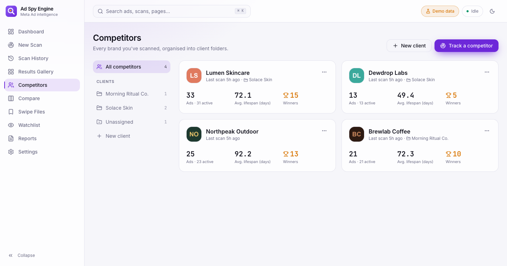 |
| 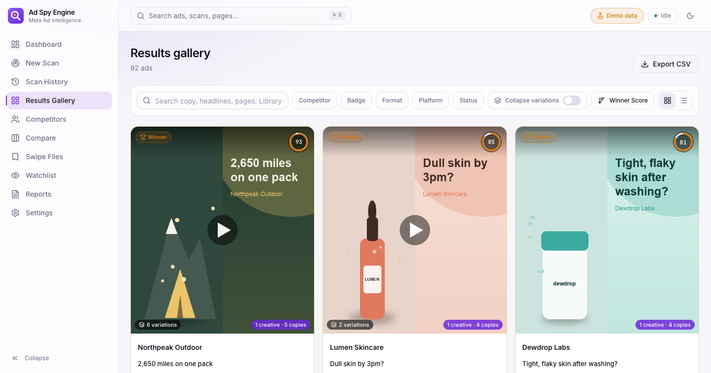 | 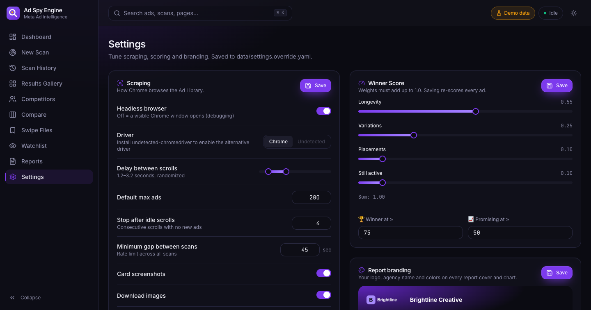 |

</details>

## ⚙️ How it works

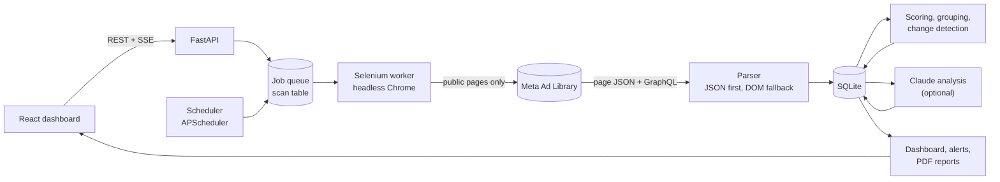

A scan is a row in the `scan` table, which doubles as the job queue. One worker thread runs
Chrome, captures the JSON the page already receives (falling back to text-anchored DOM parsing),
and streams progress to the browser over Server-Sent Events. After the scan: scoring, variation
grouping, landing page capture and change detection. More in [ARCHITECTURE.md](docs/ARCHITECTURE.md).

## 🏆 Winner Score explained

```text
longevity  = min(days_running / 90, 1)            weight 0.55
variations = min(log2(variation_count + 1) / 4, 1) weight 0.25
placements = min(platform_count / 4, 1)            weight 0.10
still_live = 1 if active else 0                    weight 0.10

score = round(100 × Σ component × weight)          → 0–100
```

| Badge | Score | Meaning |
|---|---|---|
| 🏆 **Winner** | 75–100 | Long-running and iterated. Probably profitable. |
| 📈 **Promising** | 50–74 | Has survived testing and is gaining variations. |
| 🧪 **Testing** | 0–49 | New or short-lived. |

Weights and thresholds are editable in **Settings** (saving re-scores every ad). The score is a
heuristic from public signals, not spend or conversion data.

## 🧰 Tech stack

| Layer | Tools |
|---|---|
| Scraping |   BeautifulSoup |
| Backend |   SQLModel · Alembic · APScheduler · sse-starlette |
| Data |  imagehash (pHash) · Jinja2 |
| AI |  structured outputs, `claude-sonnet-5-5` by default |
| Frontend |     TanStack Query · Recharts · Motion · Radix |
| Quality | pytest (offline fixtures from real pages) · ruff · black · mypy · ESLint · Vitest |

## 🚀 Quick start

**Prerequisites:** Python 3.11+, Node 20+, Google Chrome, Git.

<table>
<tr><th>Windows</th><th>macOS / Linux</th></tr>
<tr>
<td>

```bat
git clone https://github.com/YOUR_USERNAME/ad-spy-engine
cd ad-spy-engine
setup.bat
start.bat
```

</td>
<td>

```bash
git clone https://github.com/YOUR_USERNAME/ad-spy-engine
cd ad-spy-engine
./setup.sh
./start.sh
```

</td>
</tr>
</table>

The app opens at **http://localhost:8000** (API docs at `/api/docs`). `setup` creates a virtualenv,
installs Python and Node dependencies, builds the frontend and copies `.env.example` to `.env`.

**Try it without scanning:** `python scripts/seed_demo.py`, then `python backend/run.py --demo`.

<details>
<summary><b>CLI usage</b></summary>

```bash
cd backend
python cli.py scan "Gymshark" --exact-page --max-ads 200      # keyword search, brand's own page only
python cli.py scan 129669023798560 --page-id --country GB     # exact Page ID
python cli.py scan "running shoes" --media video --visible    # watch Chrome work
python cli.py scans                                           # recent scans
python cli.py ads --scan 12 --limit 20                        # best ads of scan 12
python cli.py report 12                                       # branded HTML report
```

On Windows use `..\.venv\Scripts\python`, on macOS/Linux `../.venv/bin/python` (or activate the venv).
</details>

## 🔧 Configuration

<details>
<summary><b><code>.env</code>: secrets and integrations (all optional)</b></summary>

| Variable | Purpose |
|---|---|
| `ANTHROPIC_API_KEY` | Enables AI copy analysis and AI report opportunities |
| `ANTHROPIC_MODEL` | Overrides the model (default `claude-sonnet-5-5`) |
| `TELEGRAM_BOT_TOKEN`, `TELEGRAM_CHAT_ID` | Telegram alerts |
| `SMTP_HOST`, `SMTP_PORT`, `SMTP_USER`, `SMTP_PASSWORD`, `SMTP_FROM`, `SMTP_TO`, `SMTP_STARTTLS` | Email alerts (port 465 = SSL, otherwise STARTTLS) |
| `ADSPY_DATA_DIR` | Where the database, media, reports and logs live (default `./data`) |
| `ADSPY_HOST`, `ADSPY_PORT` | Server address (default `127.0.0.1:8000`) |
| `CHROME_BINARY` | Use a specific Chrome build |
</details>

<details>
<summary><b><code>config/settings.yaml</code>: behaviour (most are editable in Settings)</b></summary>

| Key | Default | What it does |
|---|---|---|
| `scraping.headless` | `true` | `false` opens a visible Chrome window |
| `scraping.delay_range` | `[1.2, 3.2]` | Random pause between scrolls (seconds) |
| `scraping.max_ads` | `200` | Default cap per scan |
| `scraping.no_new_ads_attempts` | `4` | Stop after this many scrolls with nothing new |
| `scraping.min_seconds_between_scans` | `45` | Rate limit across all scans |
| `scraping.screenshots` / `download_media` / `download_videos` | `true` / `true` / `false` | What to save per ad |
| `landing.max_per_scan` | `10` | Landing pages screenshotted after each scan |
| `scoring.weights` / `thresholds` | see above | Winner Score |
| `ai.model` / `ai.batch_size` | `claude-sonnet-5-5` / `10` | AI analysis |
| `reports.agency_name` / colors | `Ad Spy Engine` | Report branding (logo upload in Settings) |

UI changes are saved to `data/settings.override.yaml`. Page selectors and text anchors live in
`config/selectors.yaml`, so a Meta layout change is usually a config edit, not a code change.
</details>

## 🗂️ Project structure

<details>
<summary>Show tree</summary>

```text
ad-spy-engine/
├── backend/
│   ├── app/
│   │   ├── api/          # scans, ads, competitors, clients, compare, boards, watchlist,
│   │   │                 # changes, reports, settings, ai, events (SSE)
│   │   ├── analysis/     # scoring, grouping, changes, insights, ai
│   │   ├── core/         # config, paths, logging, demo mode
│   │   ├── db/           # SQLModel models, Alembic migrations
│   │   ├── jobs/         # scan worker, AI worker, scheduler, event bus
│   │   ├── notify/       # telegram, email
│   │   ├── reports/      # builder, Chrome PDF, Jinja templates
│   │   └── scraper/      # driver, ad_library, parser, media, landing, humanize, cleanup
│   ├── tests/            # pytest + gzipped fixtures captured from real Ad Library pages
│   ├── cli.py
│   └── run.py
├── frontend/src/         # pages/, components/, hooks/, lib/
├── config/               # settings.yaml, selectors.yaml
├── docs/                 # ARCHITECTURE, KNOWN_ISSUES, LEGAL, benchmarks.json, assets/, case-study/
├── scripts/              # seed_demo, capture_screenshots, benchmark, export_case_study, capture_fixtures
├── setup.bat / setup.sh, start.bat / start.sh, dev.bat / dev.sh
└── data/                 # git-ignored: app.db, media/, reports/, logs/
```
</details>

## 📊 Benchmarks

Measured by [`scripts/benchmark.py`](scripts/benchmark.py) on real scans of the public Ad Library
(US, headless Chrome 154, Apple Silicon Mac, home connection). Raw numbers:
[`docs/benchmarks.json`](docs/benchmarks.json).

| Scan | Ads collected | Time | Ads / minute | Ads processed without error |
|---|---:|---:|---:|---:|
| Gymshark (cap 300) | 300 | 83 s | 216 | 100% |
| Huel (cap 200) | 200 | 91 s | 132 | 100% |
| **Total** | **500** | **174 s** | **172** | **100%** |

- Every collected ad had its Library ID, start date, placements, copy, card screenshot and creative.
- The same 500 ads would take about **6 hours** to log by hand, against **under 3 minutes** here.
  *Assumption: 45 seconds per ad to open, read, note dates and placements, and save a
  screenshot. This is our estimate, not a measured study.*
- 107 automated tests run offline against fixtures captured from real Ad Library pages.

## 🗺️ Roadmap

- [x] Core scraper, parser, Winner Score, CLI
- [x] Live dashboard with SSE progress
- [x] Variation grouping, landing pages, AI copy analysis
- [x] Watchlist, change detection, Telegram/email alerts
- [x] Client folders, Compare, swipe files, branded PDF reports
- [ ] Drag-and-drop between swipe-file boards
- [ ] Video transcription for video-ad hooks
- [ ] TikTok Creative Center and Google Ads Transparency Center sources
- [ ] Packaged desktop installer (no Python/Node setup)

## ⚖️ Responsible use

- **Public data only.** Reads the public Ad Library web pages that anyone can open without an account.
- **No login, no captcha bypass.** If Meta asks for either, the scan stops and is marked `blocked`.
- **Rate-limited.** One scan at a time, randomized delays, a minimum gap between scans.
- **Your call on Meta's terms.** Automated collection may be restricted by Meta's Terms. Keep
  volumes low and use it for your own research. Creatives belong to their advertisers.
- **Why not the official API?** Meta's Ad Library API mainly covers political/social-issue ads
  and ads delivered in the EU, so ordinary commercial ads elsewhere are only visible on the
  public website.

Details in [docs/LEGAL.md](docs/LEGAL.md). Known limitations in [docs/KNOWN_ISSUES.md](docs/KNOWN_ISSUES.md).

---

<div align="center">


### Md Zarin Tasnim
**Automation Developer & Creative Strategist**

Need a custom automation or scraping tool? Let's talk.

<a href="https://www.upwork.com/freelancers/YOUR_PROFILE"></a>
<a href="https://github.com/YOUR_USERNAME/ad-spy-engine"></a>

<sub>Released under the [MIT License](LICENSE). Not affiliated with or endorsed by Meta Platforms, Inc.</sub>

</div>
