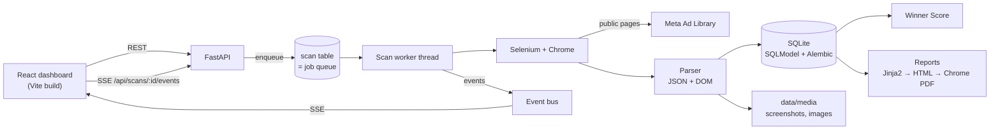

# Architecture

Ad Spy Engine is a local-first app: one Python process serves the API, runs scans on a background
thread, and serves the built React dashboard. Nothing needs Redis, Docker or a cloud account.

## Request flow of a scan

1. `POST /api/scans` validates the input and creates a `Scan` row (`queued`) plus its `Competitor`.
   It then calls `worker.enqueue()`.
2. `ScanWorker` (a single-thread `ThreadPoolExecutor`) picks the scan up. It enforces the
   `min_seconds_between_scans` rate limit and calls `runner.run_scan()`.
3. `AdLibraryScraper` launches Chrome via `driver.create_driver()`. Before any page script runs, it
   injects a hook (`XHR_CAPTURE_JS`) that keeps a copy of the Ad Library's own `/api/graphql/`
   pagination responses.
4. The scraper opens the search URL, dismisses cookie dialogs, checks for blocking, and reads the
   server-rendered JSON (first page + Meta's estimated total). Then it scrolls with randomized,
   human-like pacing.
5. After each scroll it drains the captured JSON and finds new ad cards in the DOM. Cards are
   located by the "Library ID" text anchor, never by CSS classes. For each card it:
   - maps the JSON node → `AdRecord` (`parser.record_from_node`);
   - parses the card HTML → `AdRecord` (`parser.record_from_card_html`) as a fallback;
   - merges the two (JSON wins, DOM fills gaps and supplies `raw_html`);
   - screenshots the card element, with sticky overlays hidden.
6. `runner.on_ad` upserts the `Ad`, writes an `AdSnapshot` for this scan, computes the Winner
   Score, saves the screenshot and queues media downloads on a small thread pool.
7. Events (`status`, `progress`, `ad`, `log`, `blocked`) go to the in-process `EventBus`, which
   fans them out to SSE subscribers. Log lines come from a logging handler bound to the scan thread.

## Why JSON first

The Ad Library page already contains every result as structured JSON. That is the same data its
React UI renders: Library ID, page, start/end timestamps, placements, collation count, creative
URLs, CTA and link. Reading it is more accurate and far more stable than scraping the rendered
DOM, whose class names are obfuscated and change on every Meta deploy. The text-anchored DOM
parser stays as a fallback and is tested against the same fixtures, so a Meta change that removes
the JSON degrades the data but doesn't break scans.

## Reliability

| Failure | Handling |
|---|---|
| Stale element / timeout | `with_retries()` exponential backoff |
| One ad fails to parse | counted in `ads_failed`, logged, scan continues |
| Login wall / checkpoint / captcha flag | `ScanBlocked` → status `blocked` + suggestions; never bypassed |
| Cancel button / Ctrl+C | `threading.Event` checked between ads and during sleeps; browser closed |
| App closed mid-scan | graceful shutdown cancels and marks `interrupted` |
| Hard crash (kill -9, power loss) | startup marks `running` scans `interrupted`, re-queues `queued` ones; counters are saved every 10 ads |
| Orphaned Chrome after a crash | PIDs + profile dirs tracked in `data/run/drivers.json`, killed on next start |

## Intelligence pipeline (after each scan)

1. **Grouping** (`analysis/grouping.py`). Computes a 64-bit pHash of each thumbnail and a hash of
   the normalized copy. Candidate pairs come from 8-band LSH (two hashes within 6 bits always
   share ≥ 2 bands), confirmed by Hamming distance. Copy matches use exact hash plus
   `SequenceMatcher ≥ 0.92` within a first-three-words block. Union-find yields groups; each ad
   stores `group_key`, `group_size`, `group_creatives` and `group_copies`.
2. **Landing pages** (`scraper/landing.py`). Normalizes URLs (drops `utm_*`, `fbclid`, …), skips
   on-platform destinations, and captures the top `landing.max_per_scan` distinct pages by Winner
   Score with a separate headless Chrome.
3. **AI analysis** (`analysis/ai.py`, on demand). `AiWorker` runs batches of `ai.batch_size` ads
   per `messages.create` call with `output_config.format` (JSON schema) and `effort: low`. Each
   batch is validated with Pydantic and stored in `adanalysis`, keyed by Library ID, so an ad is
   never paid for twice. A failing batch is counted and skipped; the run continues.

## Monitoring

- `jobs/scheduler.py`: an APScheduler `BackgroundScheduler` in the local time zone, with one cron
  job per enabled `WatchlistItem` (re-synced whenever the watchlist changes). A run creates a
  normal scan with `trigger="schedule"` and enqueues it on the same scan worker, so rate limits
  and one-at-a-time still apply. On startup, items whose `next_run_at` passed while the app was
  closed are run once.
- `analysis/changes.py` runs after every completed scan. It compares `AdSnapshot` sets with the
  previous comparable scan, writes `ChangeEvent` rows (`new`, `stopped`, `scaled`), and stores a
  summary on the scan.
- `notify/`: after a scheduled scan finishes with changes (or is blocked or fails), the worker
  sends one alert to each configured channel. A failing channel never blocks the other.

## Data model

- `competitor`: one tracked brand (name, optional Page ID, local logo).
- `scan`: one run (filters, status, counters, timing, log path). Doubles as the job queue.
- `ad`: unique by `library_id`; latest parsed values, score + breakdown, local media paths, and
  zlib-compressed `raw_json`/`raw_html` so ads can be re-parsed (`cli.py reparse`) after parser fixes.
- `adsnapshot`: one row per ad per scan. This is the basis for change detection (Phase 4).
- `report`: generated reports (HTML + PDF paths, options).
- `landingpage`: one screenshot per normalized destination URL.
- `watchlistitem` / `changeevent`: schedules and detected changes between scans.
- `adanalysis` / `airun`: cached AI results per Library ID, and per-run token/cost accounting.

Schema changes go through Alembic (`backend/app/db/migrations`). Migrations run automatically at startup.

## Frontend

React 19 + TypeScript + Vite, with Tailwind v4 tokens (dark first) and shadcn-style components on
Radix primitives. TanStack Query handles server state, SSE (`EventSource`) carries live progress,
and Motion handles micro-animations. In production FastAPI serves `frontend/dist`. In development
Vite proxies `/api` and `/files` to `:8000`.

## Files served

Only `data/media` and `data/reports` are mounted (`/files/media`, `/files/reports`). The database,
logs and settings are never served. The server binds to `127.0.0.1` by default.
